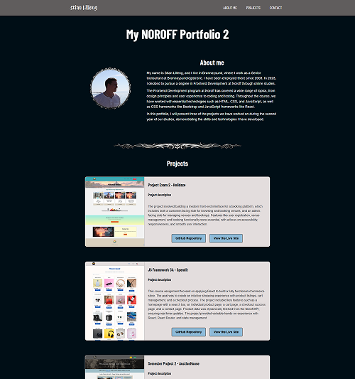

# Portfolio 2

## Stian Lilleng



Portfolio for the second year of Frontend Development studies at NOROFF 😄

## Visit the page at:

[](https://portfolio2-stianl.netlify.app/)

## Description

This page showcases three projects that I worked on throughout the second year of the Frontend Development studies at NOROFF. I decided to recreate the page I made for POR1 using React for this project.

The portfolio highlights key projects, each presented with a brief description, a preview image, and links to both the GitHub repository and the live site. The page is fully responsive and structured to provide a clean and professional overview of my work.

## Built With

- Styled Components
- JavaScript
- React
- Vite

## Getting Started

### Installing

Clone the repo:

```
git clone git@github.com/StianL82/portfolio2
```

Install dependencies

```
npm install
```

## Run the project

Start the development server

```
npm run dev
```

### Running

Open with live server, or open in browser [Link to page](https://portfolio2-stianl.netlify.app/).

### Contributing

This repo is not open to any contributions.

## Contact 📫

Feel free to contact me at stian.lilleng@gmail.com
